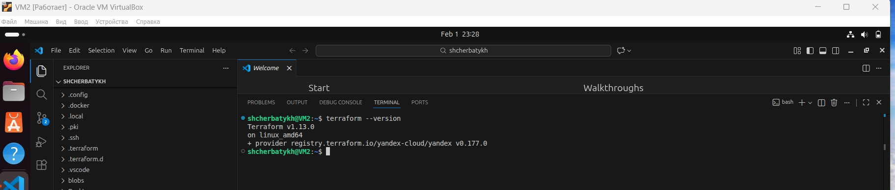
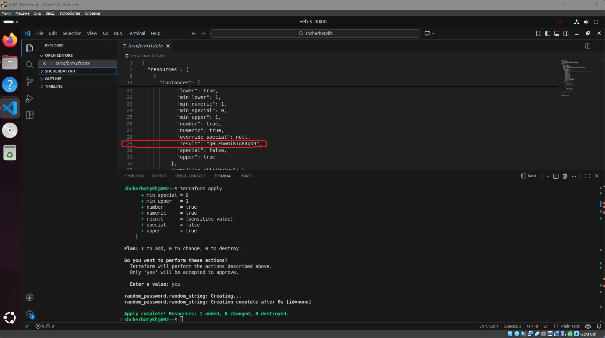
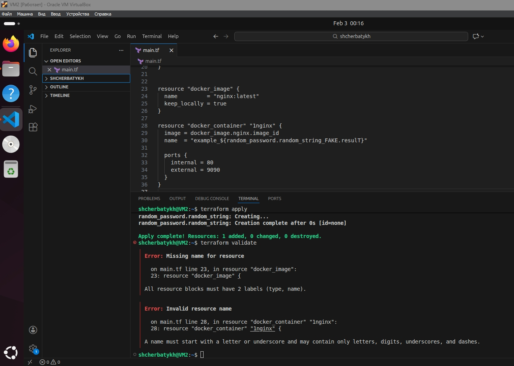

## Домашнее задание к занятию «Введение в Terraform» Щербатых А.Е. (FOPS-38)

### Цели задания

1. Установить и настроить Terrafrom.
2. Научиться использовать готовый код.
 --- 
### Чек-лист готовности к домашнему заданию

1. Скачайте и установите Terraform версии >=1.12.0 . Приложите скриншот вывода команды terraform --version.
2. Скачайте на свой ПК этот git-репозиторий. Исходный код для выполнения задания расположен в директории 01/src.
3. Убедитесь, что в вашей ОС установлен docker.
---
### Инструменты и дополнительные материалы, которые пригодятся для выполнения задания

1. Репозиторий с ссылкой на зеркало для установки и настройки Terraform: [ссылка](https://github.com/netology-code/devops-materials).
2. Установка docker: [ссылка](https://docs.docker.com/engine/install/ubuntu/).
---

### Задание 1
1. Перейдите в каталог src. Скачайте все необходимые зависимости, использованные в проекте.
2. Изучите файл .gitignore. В каком terraform-файле, согласно этому .gitignore, допустимо сохранить личную, секретную информацию?(логины,пароли,ключи,токены итд)
3. Выполните код проекта. Найдите в state-файле секретное содержимое созданного ресурса random_password, пришлите в качестве ответа конкретный ключ и его значение.
4. Раскомментируйте блок кода, примерно расположенный на строчках 29–42 файла main.tf. Выполните команду terraform validate. Объясните, в чём заключаются намеренно допущенные ошибки. Исправьте их.
5. Выполните код. В качестве ответа приложите: исправленный фрагмент кода и вывод команды docker ps.
6. Замените имя docker-контейнера в блоке кода на hello_world. Не перепутайте имя контейнера и имя образа. Мы всё ещё продолжаем использовать name = "nginx:latest". Выполните команду terraform apply -auto-approve. Объясните своими словами, в чём может быть опасность применения ключа -auto-approve. Догадайтесь или нагуглите зачем может пригодиться данный ключ? В качестве ответа дополнительно приложите вывод команды docker ps.
7. Уничтожьте созданные ресурсы с помощью terraform. Убедитесь, что все ресурсы удалены. Приложите содержимое файла terraform.tfstate.
8. Объясните, почему при этом не был удалён docker-образ nginx:latest. Ответ ОБЯЗАТЕЛЬНО НАЙДИТЕ В ПРЕДОСТАВЛЕННОМ КОДЕ, а затем ОБЯЗАТЕЛЬНО ПОДКРЕПИТЕ строчкой из документации terraform провайдера docker. (ищите в классификаторе resource docker_image )
---
## Дополнительное задание (со звёздочкой*)
Настоятельно рекомендуем выполнять все задания со звёздочкой. Они помогут глубже разобраться в материале.
Задания со звёздочкой дополнительные, не обязательные к выполнению и никак не повлияют на получение вами зачёта по этому домашнему заданию.

### Задание 2*

1. Создайте в облаке ВМ. Сделайте это через web-консоль, чтобы не слить по незнанию токен от облака в github(это тема следующей лекции). Если хотите - попробуйте сделать это через terraform, прочитав документацию yandex cloud. Используйте файл personal.auto.tfvars и гитигнор или иной, безопасный способ передачи токена!
2. Подключитесь к ВМ по ssh и установите стек docker.
3. Найдите в документации docker provider способ настроить подключение terraform на вашей рабочей станции к remote docker context вашей ВМ через ssh.
4. Используя terraform и remote docker context, скачайте и запустите на вашей ВМ контейнер mysql:8 на порту 127.0.0.1:3306, передайте ENV-переменные. Сгенерируйте разные пароли через random_password и передайте их в контейнер, используя интерполяцию из примера с nginx.(name  = "example_${random_password.random_string.result}" , двойные кавычки и фигурные скобки обязательны!)

 ```bash
    environment:
      - "MYSQL_ROOT_PASSWORD=${...}"
      - MYSQL_DATABASE=wordpress
      - MYSQL_USER=wordpress
      - "MYSQL_PASSWORD=${...}"
      - MYSQL_ROOT_HOST="%"
   ```

5. Зайдите на вашу ВМ , подключитесь к контейнеру и проверьте наличие секретных env-переменных с помощью команды env. Запишите ваш финальный код в репозиторий.

### Задание 3*

1. Установите opentofu(fork terraform с лицензией Mozilla Public License, version 2.0) любой версии
2. Попробуйте выполнить тот же код с помощью tofu apply, а не terraform apply.

---

### Ответы к заданию 1

Проверяю установленную версию Terraform



2. Согласно предложенному ```.gitignore```, допустимо сохранить личную, секретную информацию?(логины,пароли,ключи,токены итд) в файле ```personal.auto.tfvars```.

3. Найдите в state-файле секретное содержимое созданного ресурса random_password, пришлите в качестве ответа конкретный ключ и его значение.



4. После раскомментирования строк и выполнения команды ```terraform validate``` получаем сообщение об ошибке



```bash
│ Error: Missing name for resource
│ 
│   on main.tf line 23, in resource "docker_image":
│   23: resource "docker_image" {
│ 
│ All resource blocks must have 2 labels (type, name).
```

Буквальный перевод "Все блоки ресурсов должны иметь 2 метки (тип, название)". Т.е. Отсутствует имя ресурса ```docker_image```.

Правильно записать следующим образом:

```bash
resource "docker_image" "nginx" {
###...
}
```


Вторая ошибка

```bash
│ Error: Invalid resource name
│ 
│   on main.tf line 28, in resource "docker_container" "1nginx":
│   28: resource "docker_container" "1nginx" {
│ 
│ A name must start with a letter or underscore and may contain only letters, digits, underscores, and dashes.
```
Перевод "Имя должно начинаться **с буквы или символа подчеркивания** и может содержать только буквы, цифры, знаки подчеркивания и тире". А в раскомментированной сроке имя начинается с цифры 1, что и вызывает ошибку.

Корректно записать следующим образом:

```bash
resource "docker_container" "nginx_1" {
###...
}
```
