## Домашнее задание «Основы Terraform. Yandex Cloud» Щербатых А.Е. FOPS-38

### Задание 1

В качестве ответа всегда полностью прикладывайте ваш terraform-код в git. Убедитесь что ваша версия Terraform ~>1.12.0

Изучите проект. В файле variables.tf объявлены переменные для Yandex provider.

Создайте сервисный аккаунт и ключ. service_account_key_file.

Сгенерируйте новый или используйте свой текущий ssh-ключ. Запишите его открытую(public) часть в переменную vms_ssh_public_root_key.

Инициализируйте проект, выполните код. Исправьте намеренно допущенные синтаксические ошибки. Ищите внимательно, посимвольно. Ответьте, в чём заключается их суть.

Подключитесь к консоли ВМ через ssh и выполните команду  curl ifconfig.me. Примечание: К OS ubuntu "out of a box, те из коробки" необходимо подключаться под пользователем ubuntu: "ssh ubuntu@vm_ip_address". Предварительно убедитесь, что ваш ключ добавлен в ssh-агент: 
eval $(ssh-agent) && ssh-add Вы познакомитесь с тем как при создании ВМ создать своего пользователя в блоке metadata в следующей лекции.;

Ответьте, как в процессе обучения могут пригодиться параметры preemptible = true и core_fraction=5 в параметрах ВМ.

В качестве решения приложите:

- скриншот ЛК Yandex Cloud с созданной ВМ, где видно внешний ip-адрес;
- скриншот консоли, curl должен отобразить тот же внешний ip-адрес;
- ответы на вопросы.

---
### Ответ 1

Проверяем версию Terraform

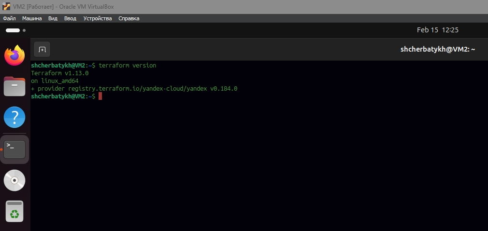

Создал сервисный аккаунт и ключ.

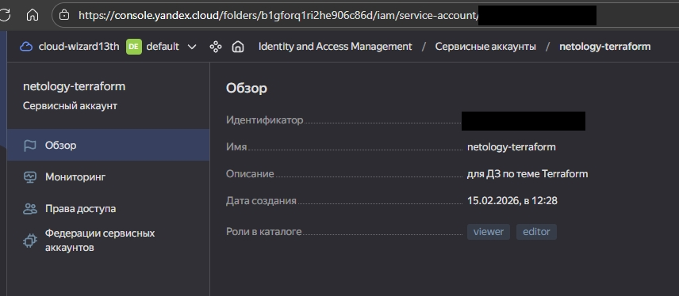

Сгенерировал ssh-ключ. Записал его открытую (public) часть в переменную vms_ssh_public_root_key.

Инициализировал проект. Выявил ошибки

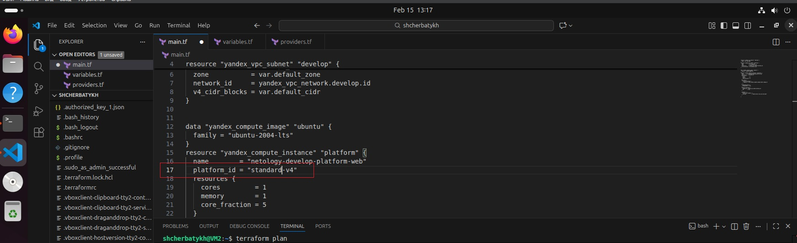

Сразу бросилось в глаза, что написано ```standart``` вместо правильного ```standard```. Исправил. Попробовал выполнить ```terraform apply``` но снова получил сообщение об ошибке

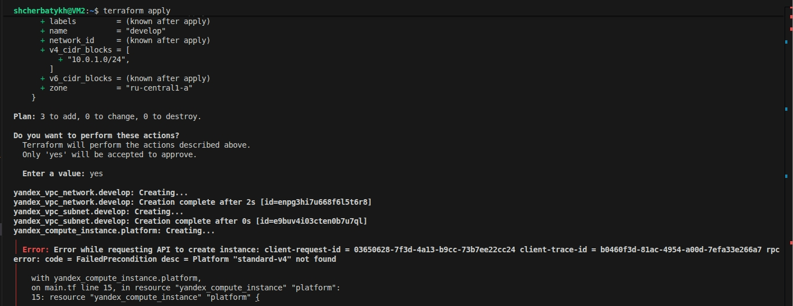

Внимательно изучил документацию [Yandex.Cloud](https://yandex.cloud/ru/docs/compute/concepts/performance-levels) и вспомнил, что для процессоров Intel есть только ```v3```, а ```v4``` с литерой ```a``` - это для платформы AMD. Как-нибудь попробую развернуть ВМ на ```v4a```, но в другой раз. Сегодня, при выполнении ДЗ остановлюсь на ```v3```.

Также выявил ошибку в строках конфигурации ВМ касающихся ```core_fraction``` и ```core```. Для v3 невозможно выбрать значение ```core_fraction=5```, возможно использовать только 20, 50 и 100. Этот параметр отвечает за долю вычислительного времени физических ядер, которую гарантирует vCPU. Также для v3 возможно использовать не менее 2-х вычислительных ядер. В данном условии изначально был указан параметр с 1 вычислительным ядром.

Создал ВМ в Yandex.Cloud

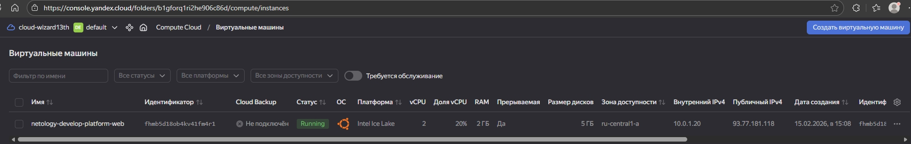

Подключился через ssh и выполнил команду ```curl ifconfig.me```

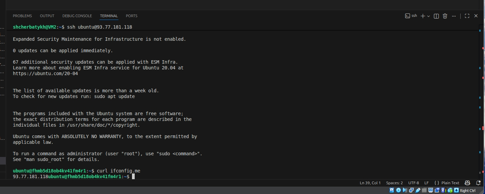

Как в процессе обучения могут пригодиться параметры preemptible = true и core_fraction=5 в параметрах ВМ? Да очень просто. Параметр ```preemptible =``` позволяет сделать ВМ прерываемой, т.е. позволяет останавливать её в любой момент. Эта "опция" применяется, если с момента запуска машины прошло 24 часа, либо возникает нехватка ресурсов для запуска других ВМ. Касаемо ```core_fraction=``` частично уже ответил выше. Этот параметр для экономии вычислительных ресурсов.

---

### Задание 2

Замените все хардкод-значения для ресурсов yandex_compute_image и yandex_compute_instance на отдельные переменные. К названиям переменных ВМ добавьте в начало префикс vm_web_ . Пример: vm_web_name.

Объявите нужные переменные в файле variables.tf, обязательно указывайте тип переменной. Заполните их default прежними значениями из main.tf.

Проверьте terraform plan. Изменений быть не должно.

---

### Ответ 2

Изучил файлы проекта. Проект разбит на отдельные файлы, описывающие ядро проекта, сетевую часть, описание общих переменных, блок провайдера, блок вывода информации.

Заменил хардкод-значения для ресурсов yandex_compute_image и yandex_compute_instance с добавлением префикса vm_web_:

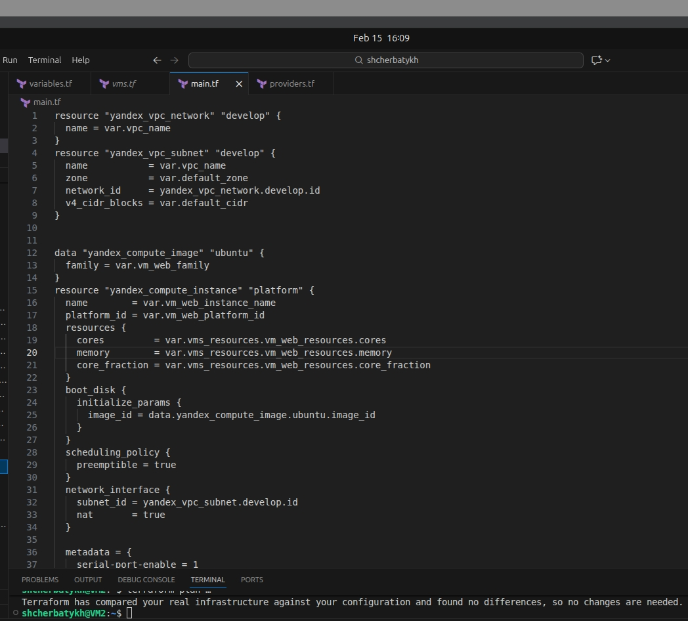

Объявил переменную, касающуюся vm_web_instance_name в файле variables.tf:

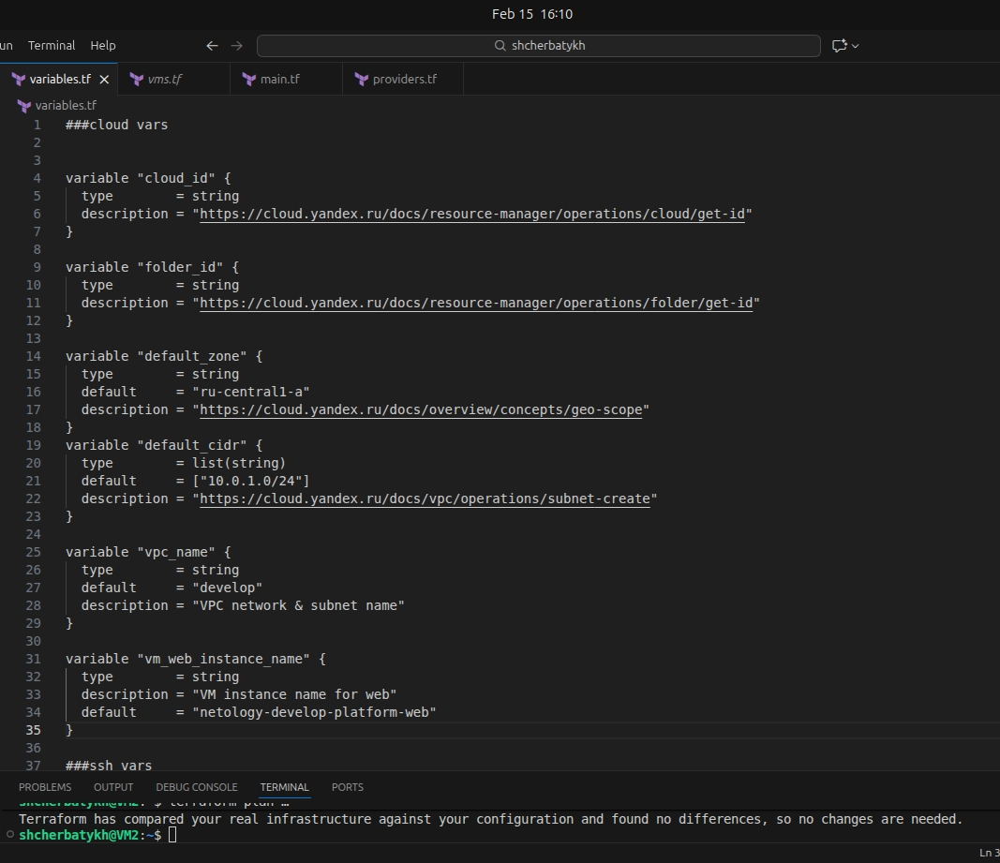

Подумал, чтобы внести все остальные переменные сюда же, но вспомнил, что на предыдущих занятиях нас учили для характеристик ВМ использовать отдельные файлы .tf для удобства настройки.
Создал файл vms.tf с описанием переменных, отвечающих за создание ВМ (какой образ ОС, какую аппаратную платформу использовать и какие вычислительные мощности заложить).

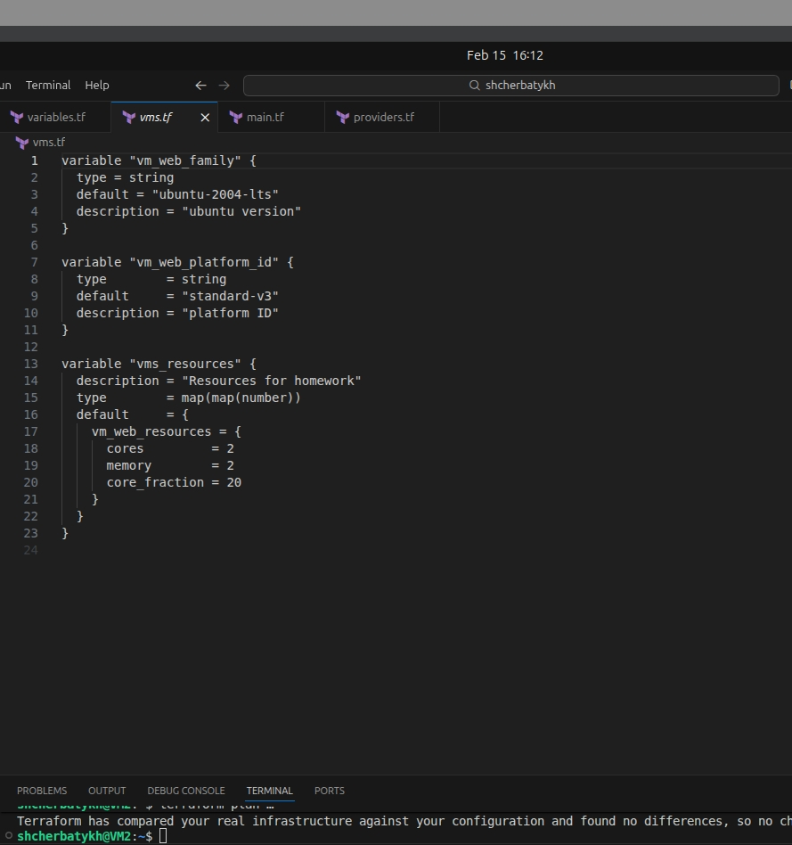

Выполнил команду ```terraform plan``` и получил сообщение, что изменений в конфигурации нет.

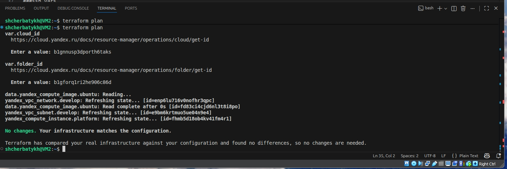

### Задание 3

Создайте в корне проекта файл 'vms_platform.tf' . Перенесите в него все переменные первой ВМ.

Скопируйте блок ресурса и создайте с его помощью вторую ВМ в файле main.tf: "netology-develop-platform-db" , cores  = 2, memory = 2, core_fraction = 20. Объявите её переменные с префиксом vm_db_ в том же файле ('vms_platform.tf'). ВМ должна работать в зоне "ru-central1-b"

Примените изменения.

---

### Ответ 3

Создал файл 'vms_platform.tf'

```bash
# vms_platform.tf - переменные для виртуальных машин

# Переменные для VM_web
variable "vm_web_instance_name" {
  type        = string
  default     = "netology-develop-platform-web"
  description = "VM instance name for web"
}

variable "vm_web_platform_id" {
  type        = string
  default     = "standard-v4a"
  description = "VM platform ID for web"
}

variable "vm_web_cores" {
  type        = number
  default     = 2
  description = "VM cores web"
}

variable "vm_web_memory" {
  type        = number
  default     = 2
  description = "VM memory web"
}

variable "vm_web_core_fraction" {
  type        = number
  default     = 20
  description = "VM core fraction web"
}

variable "vm_web_family" {
  type        = string
  default     = "ubuntu-2004-lts"
  description = "VM image family web"
}

# Переменные для VM_db
variable "vm_db_instance_name" {
  type        = string
  default     = "netology-develop-platform-db"
  description = "VM instance name for db"
}

variable "vm_db_platform_id" {
  type        = string
  default     = "standard-v4a"
  description = "VM platform ID for db"
}

variable "vm_db_cores" {
  type        = number
  default     = 2
  description = "VM cores db"
}

variable "vm_db_memory" {
  type        = number
  default     = 2
  description = "VM memory db"
}

variable "vm_db_core_fraction" {
  type        = number
  default     = 20
  description = "VM core fraction db"
}

variable "vm_db_family" {
  type        = string
  default     = "ubuntu-2004-lts"
  description = "VM image family db"
}

variable "vm_db_zone" {
  type        = string
  default     = "ru-central1-b"
  description = "VM zone db"
}
```

Подумал и немного "заморочился" с разнесением переменных по ресурсам для каждой ВМ. Из-за требований, чтобы вторая ВМ работала в зоне "ru-central1-b", пришлось внести изменения и в main.tf.
Применил изменения. Получил две работающих ВМ на платформе AMD.

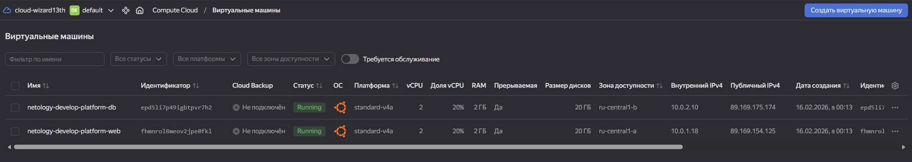

### Задание 4

Объявите в файле outputs.tf один output , содержащий: instance_name, external_ip, fqdn для каждой из ВМ в удобном лично для вас формате.(без хардкода!!!)

Примените изменения.

В качестве решения приложите вывод значений ip-адресов команды terraform output.

### Задание 5

В файле locals.tf опишите в одном local-блоке имя каждой ВМ, используйте интерполяцию ${..} с НЕСКОЛЬКИМИ переменными по примеру из лекции.

Замените переменные внутри ресурса ВМ на созданные вами local-переменные.

Примените изменения.

### Задание 6

1. Вместо использования трёх переменных ".._cores",".._memory",".._core_fraction" в блоке resources {...}, объедините их в единую map-переменную vms_resources и внутри неё конфиги обеих ВМ в виде вложенного map(object).

```bash
пример из terraform.tfvars:
vms_resources = {
  web={
    cores=2
    memory=2
    core_fraction=5
    hdd_size=10
    hdd_type="network-hdd"
    ...
  },
  db= {
    cores=2
    memory=4
    core_fraction=20
    hdd_size=10
    hdd_type="network-ssd"
    ...
  }
}
```
2. Создайте и используйте отдельную map(object) переменную для блока metadata, она должна быть общая для всех ваших ВМ.

```bash
пример из terraform.tfvars:
metadata = {
  serial-port-enable = 1
  ssh-keys           = "ubuntu:ssh-ed25519 AAAAC..."
}
```
3. Найдите и закоментируйте все, более не используемые переменные проекта.
4. Проверьте terraform plan. Изменений быть не должно.
