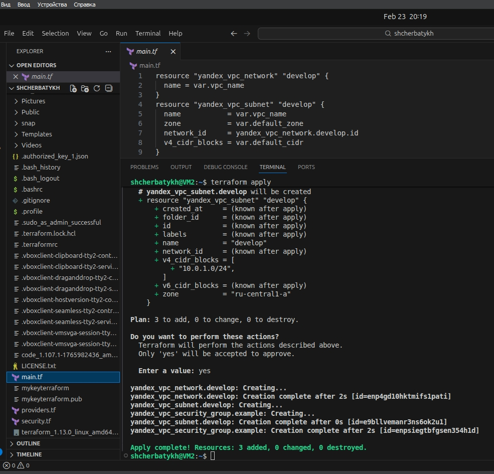
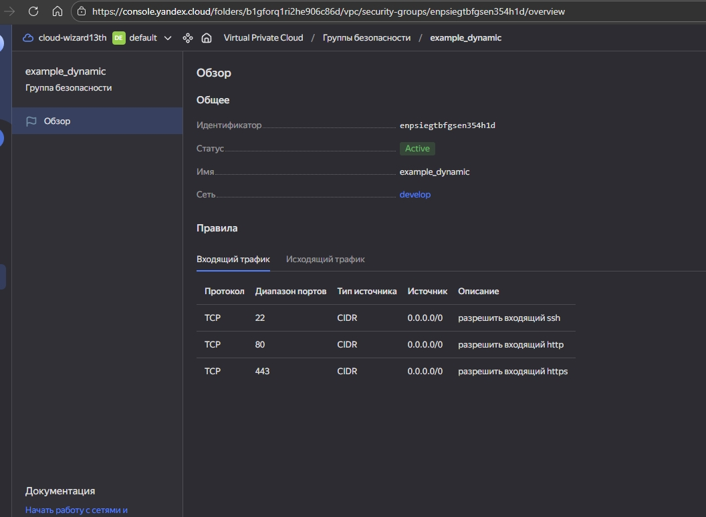
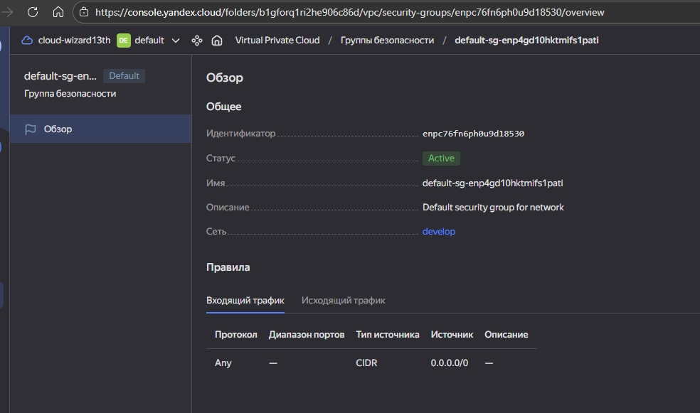
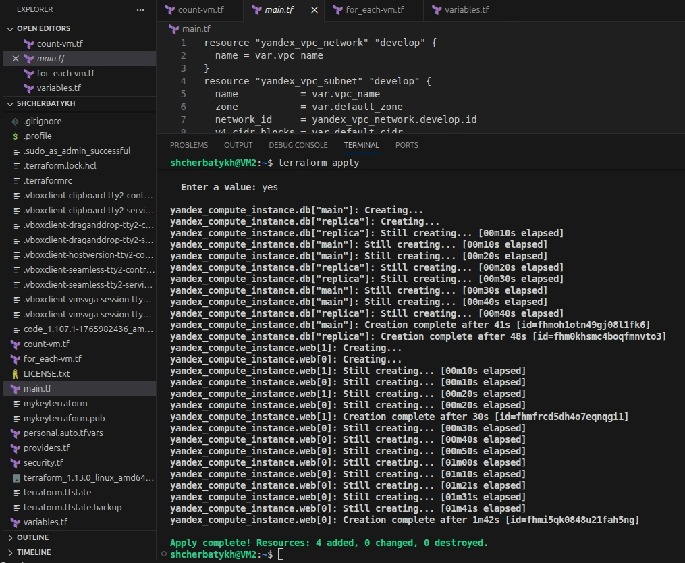
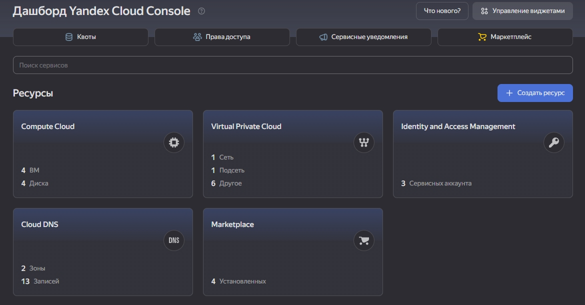

## Домашнее задание к занятию «Управляющие конструкции в коде Terraform» FOPS-38 (Щербатых А.Е.)

### Задание 1
Изучите проект.

Инициализируйте проект, выполните код.

Приложите скриншот входящих правил «Группы безопасности» в ЛК Yandex Cloud.

### Ответ 1

1. Изучил проект
2. Заполнил токен, ID облака и ID папки пользователя в personal.auto.tfvars
3. Инициализировал проект и выполнил код.







---

### Задание 2
1. Создайте файл count-vm.tf. Опишите в нём создание двух одинаковых ВМ web-1 и web-2 (не web-0 и web-1) с минимальными параметрами, используя мета-аргумент count loop. Назначьте ВМ созданную в первом задании группу безопасности.(как это сделать узнайте в документации провайдера yandex/compute_instance )
2. Создайте файл for_each-vm.tf. Опишите в нём создание двух ВМ для баз данных с именами "main" и "replica" разных по cpu/ram/disk_volume , используя мета-аргумент for_each loop. Используйте для обеих ВМ одну общую переменную типа:

```bash
variable "each_vm" {
  type = list(object({  vm_name=string, cpu=number, ram=number, disk_volume=number }))
}
```
При желании внесите в переменную все возможные параметры. 

4. ВМ из пункта 2.1 должны создаваться после создания ВМ из пункта 2.2.
5. Используйте функцию file в local-переменной для считывания ключа ~/.ssh/id_rsa.pub и его последующего использования в блоке metadata, взятому из ДЗ №2.
6. Инициализируйте проект, выполните код.

### Ответ 2

1. Создал файл count-vm.tf и описал в нем 2 одинаковые виртуальные машины, которые будут называться web-1 и web-2.

```bash
resource "yandex_compute_instance" "web" {
  count = 2
  
  depends_on = [yandex_compute_instance.db]
  
  name        = "web-${count.index + 1}"
  platform_id = "standard-v3"
  zone        = var.default_zone

  resources {
    cores         = var.vms_web_resources.cores
    memory        = var.vms_web_resources.memory
    core_fraction = var.vms_web_resources.core_fraction
  }

  boot_disk {
    initialize_params {
      image_id = "fd85qmcpsmrrg53l9082"  # Ubuntu 22.04 LTS
      size     = 20
    }
  }

  network_interface {
    subnet_id          = yandex_vpc_subnet.develop.id
    nat                = var.main_nat
    security_group_ids = [yandex_vpc_security_group.example.id]
  }

  metadata = merge(var.common_metadata, {
    ssh-keys = "ubuntu:${local.ssh_key}"
  })
}
```
2. Создал файл for_each-vm.tf. В нем описал создание двух ВМ с именами "main" и "replica" разных по cpu/ram/disk , используя мета-аргумент for_each loop.

```bash
locals {
  ssh_key = file("~/.ssh/mykeyterraform.pub")
}

resource "yandex_compute_instance" "db" {
  for_each = {
    for vm in var.each_vm : vm.vm_name => vm
  }
  
  name        = each.value.vm_name
  platform_id = "standard-v3"
  zone        = var.default_zone

  resources {
    cores         = each.value.cpu
    memory        = each.value.ram
    core_fraction = 20
  }

  boot_disk {
    initialize_params {
      image_id = "fd85qmcpsmrrg53l9082"  # Ubuntu 22.04 LTS
      size     = each.value.disk_volume
    }
  }

  network_interface {
    subnet_id          = yandex_vpc_subnet.develop.id
    nat                = var.main_nat
    security_group_ids = [yandex_vpc_security_group.example.id]
  }

  metadata = {
    serial-port-enable = "1"
    ssh-keys           = "ubuntu:${local.ssh_key}"
  }
}
```

3. ВМ с именами "main" и "replica" создаются после создания ВМ web-1 и web-2

```bash
resource "yandex_compute_instance" "web" {
  count = 2
  
  depends_on = [yandex_compute_instance.db]
  
  name        = "web-${count.index + 1}"
  platform_id = "standard-v3"
  zone        = var.default_zone
```

4. Для считывания файла ключа использую local-переменную и использую ее в блоке metadata

```bash
locals {
  ssh_key = file("~/.ssh/mykeyterraform.pub")
}
```

```bash
 metadata = {
    serial-port-enable = "1"
    ssh-keys           = "ubuntu:${local.ssh_key}"
  }
```

5. Инициализировал проект, выполнил код. К ранее созданным 3-м объектам добавилось ещё 4 ВМ




   
---

### Задание 3
Создайте 3 одинаковых виртуальных диска размером 1 Гб с помощью ресурса yandex_compute_disk и мета-аргумента count в файле disk_vm.tf .
Создайте в том же файле одиночную(использовать count или for_each запрещено из-за задания №4) ВМ c именем "storage" . Используйте блок dynamic secondary_disk{..} и мета-аргумент for_each для подключения созданных вами дополнительных дисков.

### Задание 4
В файле ansible.tf создайте inventory-файл для ansible. Используйте функцию tepmplatefile и файл-шаблон для создания ansible inventory-файла из лекции. Готовый код возьмите из демонстрации к лекции demonstration2. Передайте в него в качестве переменных группы виртуальных машин из задания 2.1, 2.2 и 3.2, т. е. 5 ВМ.
Инвентарь должен содержать 3 группы и быть динамическим, т. е. обработать как группу из 2-х ВМ, так и 999 ВМ.
Добавьте в инвентарь переменную fqdn.
[webservers]
web-1 ansible_host=<внешний ip-адрес> fqdn=<полное доменное имя виртуальной машины>
web-2 ansible_host=<внешний ip-адрес> fqdn=<полное доменное имя виртуальной машины>

[databases]
main ansible_host=<внешний ip-адрес> fqdn=<полное доменное имя виртуальной машины>
replica ansible_host<внешний ip-адрес> fqdn=<полное доменное имя виртуальной машины>

[storage]
storage ansible_host=<внешний ip-адрес> fqdn=<полное доменное имя виртуальной машины>
Пример fqdn: web1.ru-central1.internal(в случае указания переменной hostname(не путать с переменной name)); fhm8k1oojmm5lie8i22a.auto.internal(в случае отсутвия перменной hostname - автоматическая генерация имени, зона изменяется на auto). нужную вам переменную найдите в документации провайдера или terraform console. 4. Выполните код. Приложите скриншот получившегося файла.

Для общего зачёта создайте в вашем GitHub-репозитории новую ветку terraform-03. Закоммитьте в эту ветку свой финальный код проекта, пришлите ссылку на коммит.
Удалите все созданные ресурсы.


